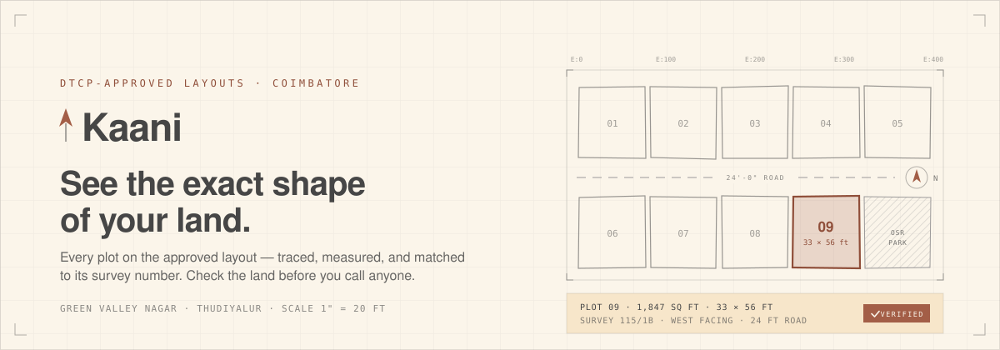
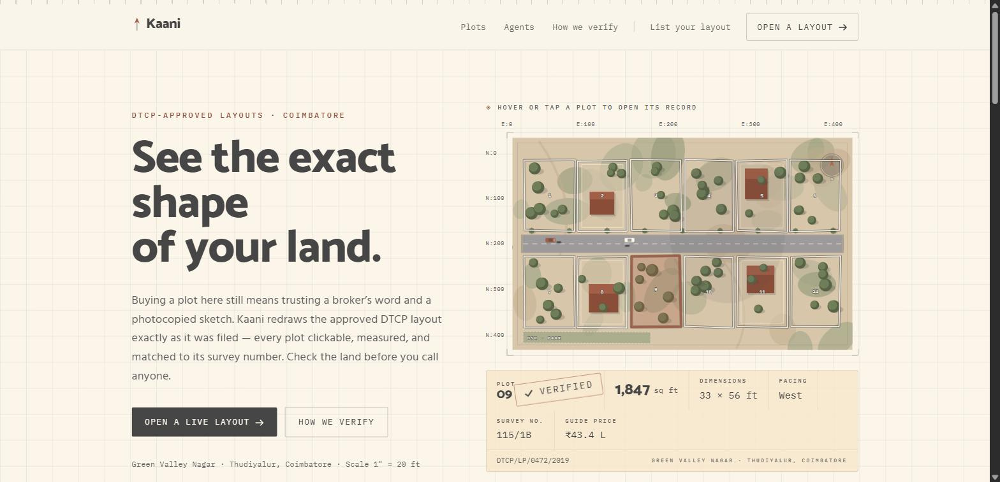
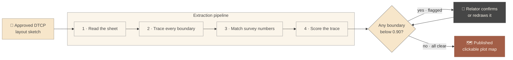
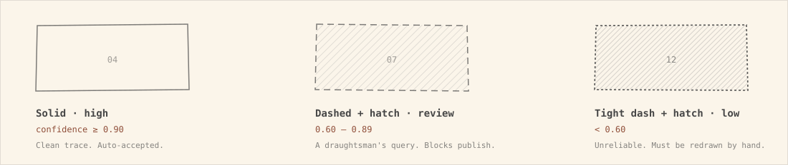
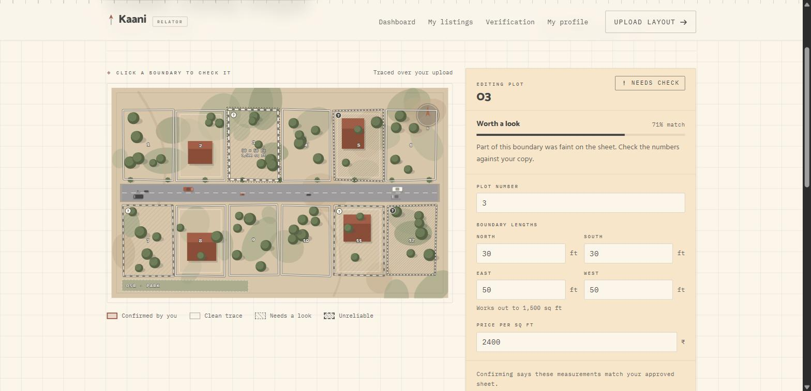
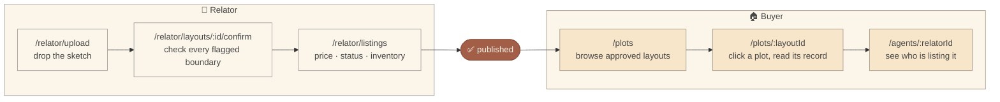
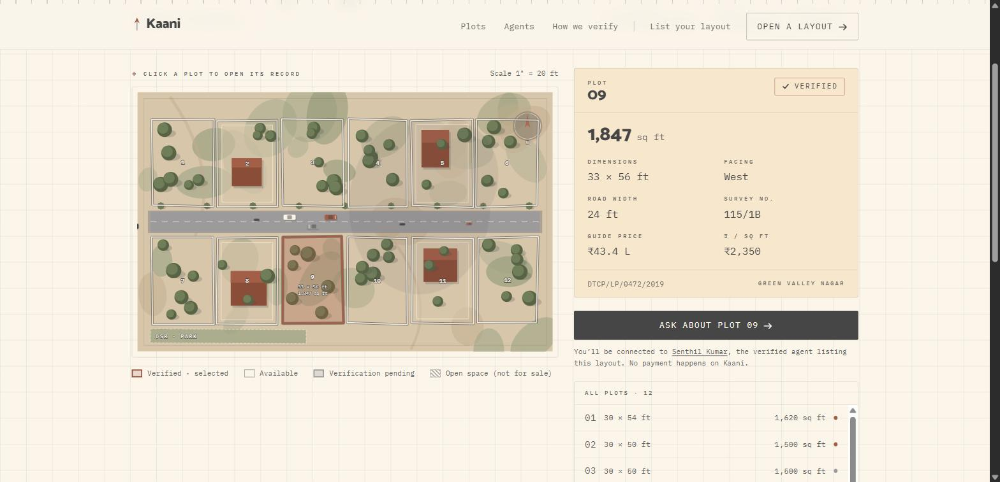
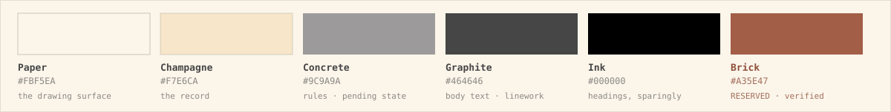

<div align="center">



<br>

### Kaani · காணி

**A plot-level land marketplace for Coimbatore, built on the one thing the market never shows you: the drawing.**

<br>


**[The problem](#problem) · [The idea](#idea) · [How it works](#how) · [Screens](#screens) · [Design](#design) · [Run it](#run)**

</div>

---

<a name="problem"></a>

## 🔍 The problem

Buying a house plot in Coimbatore still runs on paper and trust.

A DTCP-approved layout — the legal sub-division plan filed with the Directorate of Town and Country Planning — exists as **one drawing**. By the time it reaches a buyer it is a photocopy of a photocopy, folded in a broker's file, waved across a table.

So the buyer is asked to commit ₹20–40 lakh to:

| What they're shown | What they can't check |
| :-- | :-- |
| A blurry sketch, no scale | Whether **this** plot is the one on the sheet |
| "30 × 50, corner plot, east facing" | Whether it's actually 30 × 50 |
| A survey number, spoken aloud | Whether that survey number matches the boundary |
| "Fully approved, sir" | Whether the agent is even registered |

Every property portal in India lists **buildings**. Nobody renders the **land**. The listing tells you a plot exists; it never shows you its shape.

<br>

<a name="idea"></a>

## 💡 The idea

> **Kaani redraws the approved DTCP layout exactly as it was filed — and makes every plot on it clickable.**

Upload the sketch. A computer-vision pipeline traces each closed boundary off the sheet, reads the plot numbers and dimension callouts, georeferences them against the survey grid, and scores how confident it is in every single line. The result is a live plot map where clicking a plot opens its record: area, dimensions, facing, road width, survey number, guide price, and who is listing it.

The buyer checks the land **before** they call anyone. The agent gets a listing that proves itself.

And the part that makes it trustworthy: **the machine is never allowed to publish alone.** Any boundary the tracer isn't sure about is flagged, and a person has to confirm or redraw it before the layout can go live.

<p align="center">
  
  <br>
  <sub><b>/</b> — the hero <i>is</i> the product. A live layout over satellite terrain; hover any plot and its record fills in below.</sub>
</p>

<br>

<a name="how"></a>

## ⚙️ How it works



### The gate is the product

Confidence isn't shown as a percentage badge nobody reads. It's drawn into the boundary itself, using drafting convention — **solid means surveyed, dashed means queried**:



Encoding certainty as **line type rather than hue** means it survives colour-blindness, greyscale printing, and a near-monochrome palette — a red/amber scale would survive none of them.

In the sample layout, 5 of 12 boundaries come back flagged. The **Publish** control stays disabled until every one is confirmed — and the handler re-checks the rule itself, so re-enabling the button in devtools still can't push an unconfirmed trace live.

```js
const canPublish = outstanding.length === 0;

const publish = () => {
  // The disabled attribute is a UI affordance; this is the actual rule.
  if (outstanding.length > 0) return;
  setPublished(true);
};
```

<p align="center">
  
  <br>
  <sub><b>/relator/layouts/:id/confirm</b> — five boundaries came back flagged, drawn dashed and hatched on the sheet. <b>0 / 5 confirmed</b>, so nothing can publish yet.</sub>
</p>

<br>

<a name="screens"></a>

## 🧭 What you can actually do

Two complete surfaces, nine routes, all walkable in the browser today.



### 🏠 For the buyer

| Route | What it does |
| :-- | :-- |
| `/` | Landing page whose hero **is** the product — a live layout sheet that draws itself in, inside a coordinate frame with a north arrow and a docked title block that types out the featured plot's record |
| `/plots` | Browse approved layouts, filtered by verification status |
| `/plots/:layoutId` | The full plot map. Click any plot for area, dimensions, facing, road width, survey number and guide price. A spelled-out legend covers verified / available / pending / open-space |
| `/agents/:relatorId` | Public agent profile — TNRERA registration with the serial masked, areas covered, years active, live listings |

<p align="center">
  
  <br>
  <sub><b>/plots/:layoutId</b> — plot 09 selected. Area, dimensions, facing, road width, survey number and guide price, with the legend spelled out under the map.</sub>
</p>

### 📐 For the relator (agent)

| Route | What it does |
| :-- | :-- |
| `/relator` | Workspace dashboard — every uploaded layout with its extraction state: `Extracting` → `Needs review` → `Ready to publish` → `Published`, plus sold / reserved / available inventory bars |
| `/relator/upload` | Drag-and-drop the sketch, then watch the four pipeline stages run with a scan line sweeping the sheet |
| `/relator/layouts/:id/confirm` | **The core screen.** Traced sheet on the left, edit panel on the right. Fix boundary lengths, plot numbers and price; confirm each flagged plot; publish only when nothing is outstanding |
| `/relator/listings` | Plot-level inventory across layouts |
| `/relator/profile` | Identity and document verification — TNRERA certificate and PAN, with what each state means spelled out |

### One map component, four modes

`PlotOverlay` renders every plot map in the app — hero, buyer detail, browse thumbnail and relator edit — from the same SVG geometry.

| Mode | Behaviour |
| :-- | :-- |
| `hero` | Self-revealing featured plot, fully interactive afterwards |
| `detail` | Click any plot to open its record |
| `browse` | Static thumbnail, not clickable |
| `edit` | Boundaries carry trace confidence; flagged plots demand confirmation |

The visual vocabulary is shared on purpose: a plot the relator has just confirmed is drawn with the **same** brick fill a buyer sees on a verified plot — because it is the same fact. What changes between modes is the affordance, not the language.

Every map can be drawn as bare drafting linework or over a **satellite terrain view** — soil, scrub, tree canopy, rooftops and roads, all derived from the same palette — so a layout can be read as a drawing *or* as the ground it describes.

<br>

<a name="design"></a>

## 🎨 The design system

Kaani doesn't look like a property portal. It looks like **a surveyor's drawing sheet**, because that's what it's showing you: paper ground, graphite linework, drafting grid, coordinate rulers, corner crosshairs, monospaced facts.



**Brick is reserved.** It's the only accent in the product and it carries exactly one meaning: *a person verified this.* Nothing decorative is allowed to use it — which is why a brick boundary on the map is information, not styling.

| | |
| :-- | :-- |
| **Display** | Catamaran — a Tamil–Latin family, so the wordmark sits right in Coimbatore |
| **Body** | Hind Madurai |
| **Facts** | IBM Plex Mono with tabular figures, so measurements align down a column |
| **Wordmark** | The dot on the "i" is replaced by a north-arrow tick — the mark is literally a surveyor's bearing |

### Motion has rules

Everything that moves has a reason to move:

- Boundaries **draw themselves** with an irregular `pathLength` hitch, so they read as measured by hand rather than emitted by CAD
- On the terrain view, vegetation is **deliberately still** — swaying canopies at that scale read as micro-organisms, not trees. The only things that move are traffic on the internal road and a drifting cloud shadow, because that's what actually moves on a site
- Animations are `transform`-only, so they stay on the compositor instead of relaying out the page every frame

### Accessibility isn't a checkbox here

- `prefers-reduced-motion` cuts drift, sweep and reveal — and *parks* the traffic off-road rather than freezing cars mid-carriageway
- Plots are real focusable controls with `tabIndex`, `onKeyDown` and `aria-label`, so the map is keyboard-navigable
- Focus is never removed — it's redrawn as a brick crosshair ring
- Status is always carried by **line type plus text**, never by colour alone
- Inventory bars carry a spoken summary: `"3 sold, 2 reserved, 7 available of 12 plots"`

<br>

## 🛠 Tech stack

| Layer | Choice | Why |
| :-- | :-- | :-- |
| Framework | **React 19** | Plot state is plain component state — no store needed |
| Build | **Vite 8** | Instant HMR, static SPA output |
| Styling | **Tailwind CSS 4** | Tokens declared in `@theme`, so the palette lives in exactly one place |
| Motion | **Framer Motion 12** | Declarative reveals, with `useReducedMotion` built in |
| Routing | **React Router 7** | Buyer and relator surfaces share one route tree |
| Linting | **Oxlint** | Rust-fast, zero config |
| Deploy | **Vercel** | `vercel.json` rewrites every route to `index.html`, so deep links like `/plots/kovai-gv-01` survive a refresh |

Plot maps are **hand-authored SVG** — no map library, no canvas, no tiles. Around **4,300 lines** across **27 components** and two data modules, and the entire runtime dependency list is the six packages above.

<br>

<a name="run"></a>

## 🚀 Run it

```bash
git clone https://github.com/KishoreRaam/Real-Estate-E-commerce.git
cd Real-Estate-E-commerce
npm install
npm run dev
```

Then open **http://localhost:5173**

| Command | |
| :-- | :-- |
| `npm run dev` | Dev server with HMR |
| `npm run build` | Production build to `dist/` |
| `npm run preview` | Serve the production build |
| `npm run lint` | Oxlint |

**Suggested walkthrough** — the story reads best in this order:

1. **`/`** — hover a plot in the hero, watch its record fill in
2. **`/plots`** → open Green Valley Nagar — click through plots, read the legend
3. **`/relator/upload`** — drop any image, watch the four pipeline stages run
4. **`/relator/layouts/kovai-gv-01/confirm`** — try to publish. You can't: 5 boundaries are flagged. Confirm them one by one and the gate opens
5. **`/agents/senthil-kumar`** — the person behind the listing

<br>

## 🧾 What's real, and what's simulated

A product about verification shouldn't be vague about its own state. Straight answers:

| | Status |
| :-- | :-- |
| Every screen, route, interaction and state machine | ✅ **Real** and fully working |
| The publish gate — flagged boundaries block publishing | ✅ **Real**, enforced in the handler, not just the button |
| Plot geometry, areas, prices, survey numbers | ⚠️ **Placeholder** — shaped like a genuine sub-division so the interaction is honest, but the numbers carry no survey precision |
| The OpenCV extraction itself | ⚠️ **Simulated in the UI** — the upload screen runs the real stage sequence on a timer; the pipeline runs separately |
| TNRERA numbers and document checks | ⚠️ **Example data** — the verification screens render states; no government API is wired yet |

Both mock data modules say so at the top of the file, in the code, not just here:

```js
/* PLACEHOLDER GEOMETRY — not survey-accurate.
 * The shape of the data (id, no, points, status, facts) is the contract
 * the UI depends on. When the pipeline lands, replace this module with
 * its output. */
```

That contract is the point: the day the tracer returns real coordinates, nothing in the interface has to change.

<br>

## 🗺 Where this goes next

- [ ] Wire the OpenCV pipeline output in place of `plotData.js` — the data contract already matches
- [ ] Real georeferencing against Tamil Nadu survey records, so a drawn boundary carries actual lat/long
- [ ] TNRERA registry lookup instead of rendered verification states
- [ ] Buyer-side enquiry, site-visit booking and plot reservation
- [ ] Tamil language toggle — the type system was chosen for it from day one
- [ ] Expand beyond Coimbatore, district by district

<br>

---

<div align="center">

**Kaani** — *காணி*, a traditional Tamil unit of land area.

Built for people about to spend everything they have on a piece of ground they've only ever seen on a photocopy.

<sub>📍 Made in Coimbatore</sub>

</div>
